# WPUI Event Calendar

**WP Theme Support (Twenty Twenty-Four)**

- Install this app if you want to preview the README file in vscode.

<h1 align="center">🕹 Dashboard</h1>

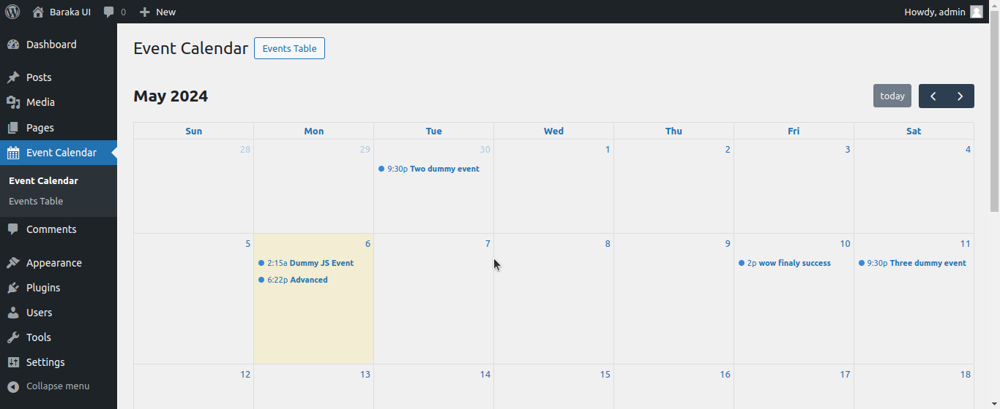
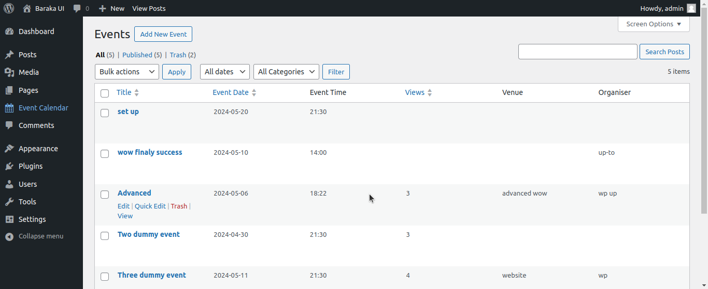

### Step 01:
> 👆 Click Appearance
> 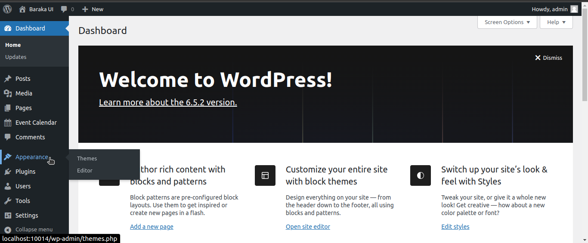

### Step 02:
> 👆 Click the Customize button
> 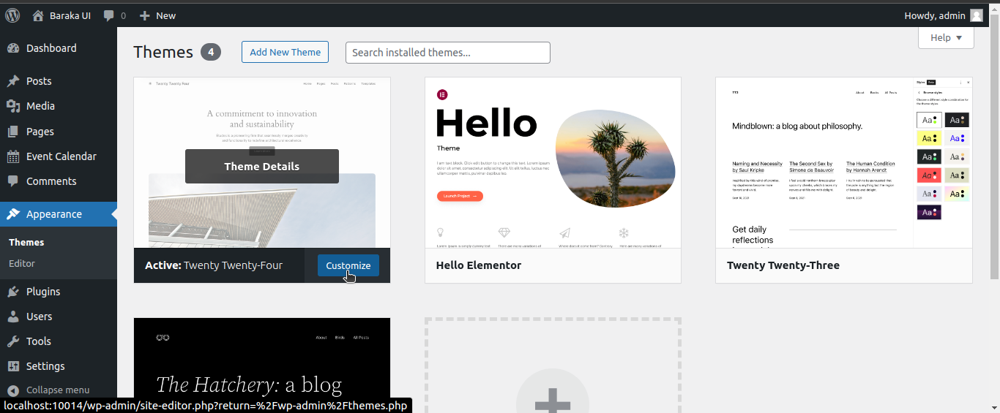

### Step 03:
> 👆 Click the Navigation menu
> 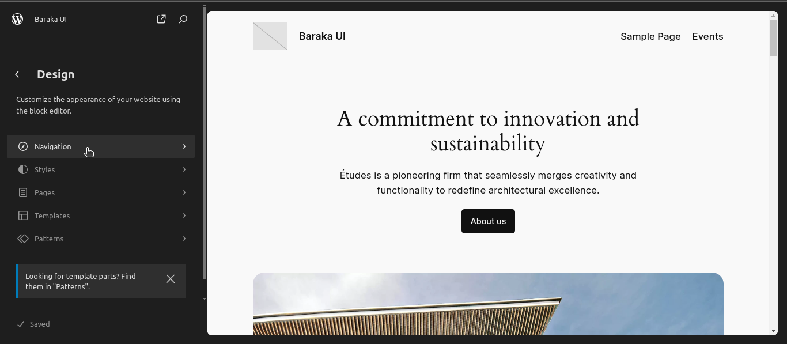

### Step 04:
> 👆 Click the Navigation edit icon
> 

### Step 05:
> 👆 Click plus icon
> 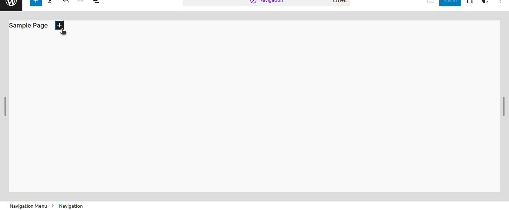

### Step 06:
> 👆 Click Add block
> 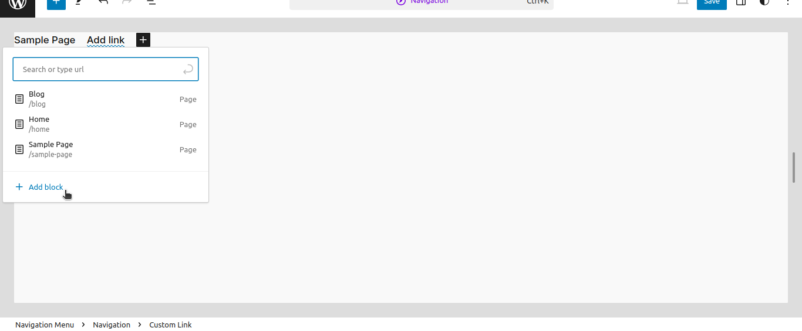

### Step 07:
> 👆 Click Custom Link
> 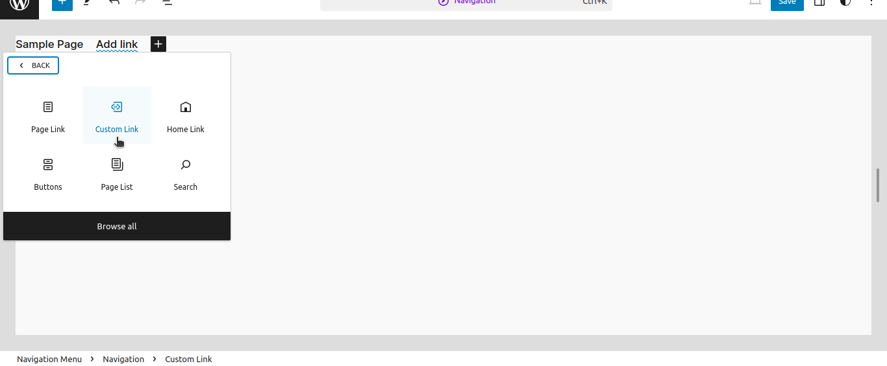

### Step 08:
> 👆 Enter **Events** name here
> 

### Step 09:
> 👆 Click the edit pen icon
> 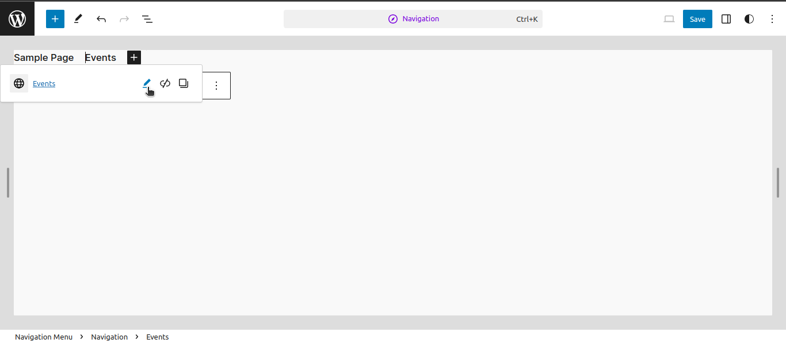

### Step 10:
> 👆 Enter **your custom** link here 👉 below the save button clicked
> 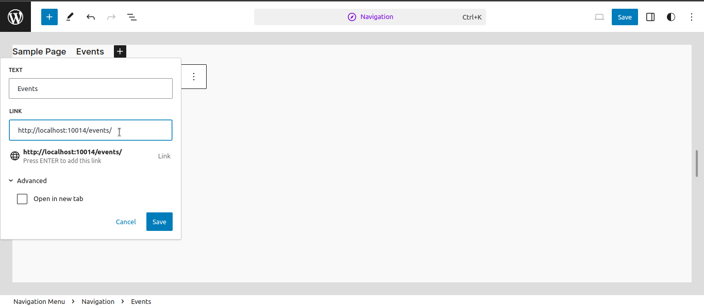

### Step 11:
> 👉 Top right the save button clicked
> 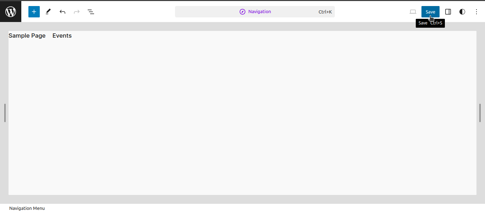

### Step 12:
> 👉 After saving, go to your home page and click the Events button in the navigation menu at the top right of the home page.
> 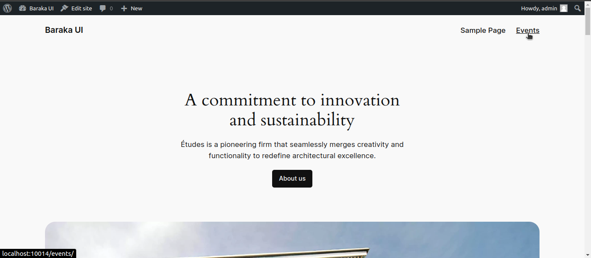

 

<h1 align="center"><b>🚀 Finally</b></h1>
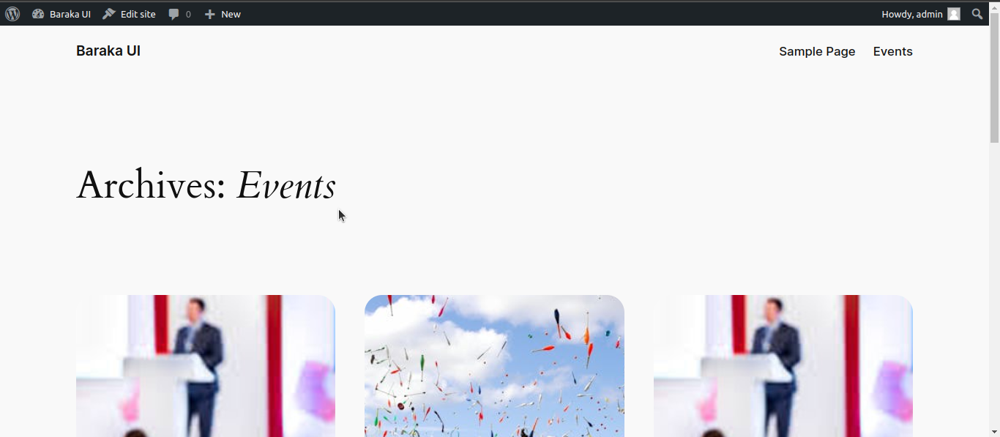
